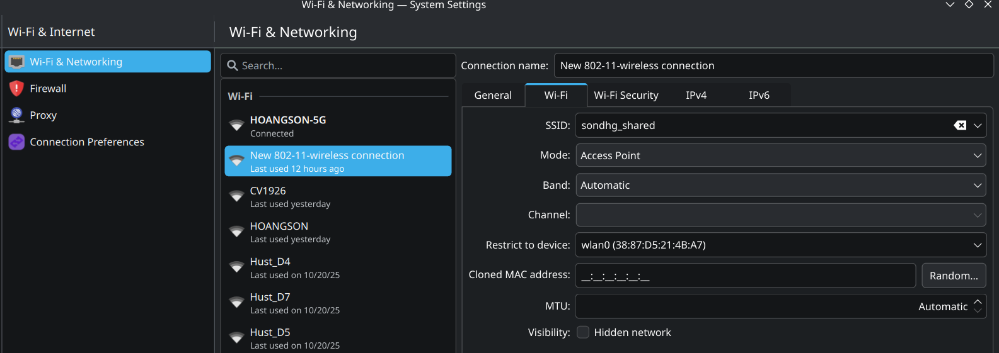
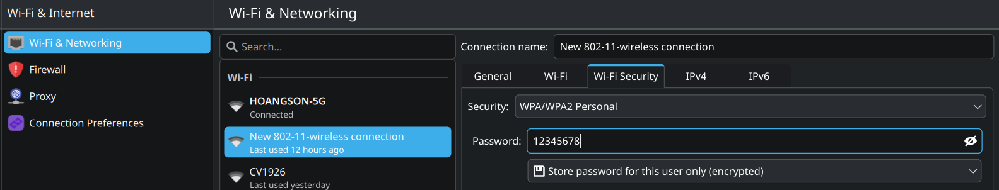
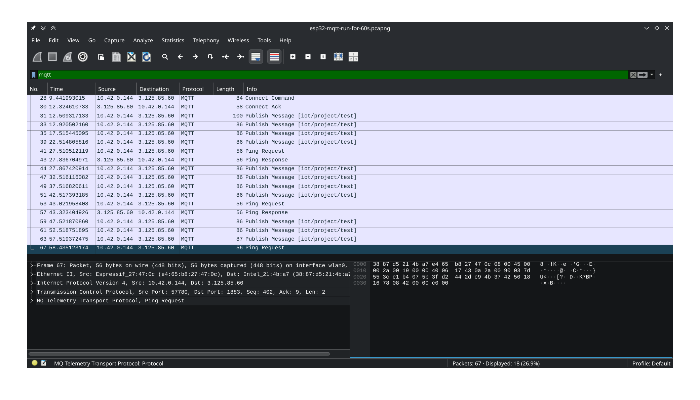
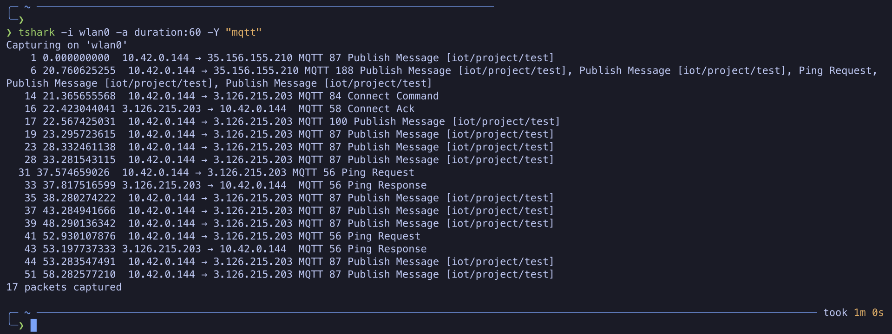

# Hướng dẫn Setup Dự án IoT: ESP32 + MQTT + Wireshark

- [Hướng dẫn Setup Dự án IoT: ESP32 + MQTT + Wireshark](#hướng-dẫn-setup-dự-án-iot-esp32--mqtt--wireshark)
  - [1. Tóm tắt luồng dữ liệu](#1-tóm-tắt-luồng-dữ-liệu)
  - [2. Cấu hình Mạng (Biến PC02 thành Gateway Router)](#2-cấu-hình-mạng-biến-pc02-thành-gateway-router)
    - [2.1. Thiết lập Nguồn Internet cho PC02 (IN) từ iPhone USB Tethering](#21-thiết-lập-nguồn-internet-cho-pc02-in-từ-iphone-usb-tethering)
    - [2.2. Thiết lập Điểm phát Hotspot (OUT) - `sondhg_shared`](#22-thiết-lập-điểm-phát-hotspot-out---sondhg_shared)
    - [2.3. Thông tin MQTT Broker](#23-thông-tin-mqtt-broker)
  - [3. Lập trình ESP32 (với VS Code + PlatformIO)](#3-lập-trình-esp32-với-vs-code--platformio)
    - [3.1. Cài đặt VS Code \& PlatformIO](#31-cài-đặt-vs-code--platformio)
    - [3.2. Tạo và Cấu hình Dự án](#32-tạo-và-cấu-hình-dự-án)
    - [3.3. Viết Code C++ (Code gửi tin mỗi 5 giây)](#33-viết-code-c-code-gửi-tin-mỗi-5-giây)
    - [3.4. Nạp Code và Kiểm tra](#34-nạp-code-và-kiểm-tra)
  - [4. Capture và Phân tích (Wireshark)](#4-capture-và-phân-tích-wireshark)
    - [4.1. Cài đặt Wireshark](#41-cài-đặt-wireshark)
    - [4.2. Đo lường Mất gói (Packet Loss) trong 60 giây](#42-đo-lường-mất-gói-packet-loss-trong-60-giây)
    - [4.3. Phân tích](#43-phân-tích)
      - [4.3.1. Loại bản tin:](#431-loại-bản-tin)
      - [4.3.2. Độ trễ (Latency):](#432-độ-trễ-latency)
      - [4.3.3. Mất gói (Packet Loss):](#433-mất-gói-packet-loss)

> **Yêu cầu: ESP32 gửi dữ liệu (các gói tin) lên MQTT Broker qua một laptop (ký hiệu **PC02**, đóng vai trò Gateway Router). PC02 này đồng thời dùng Wireshark để bắt và phân tích các gói tin đó.**

Cụ thể tôi dùng:

- PC02: DELL laptop chạy hệ điều hành Arch Linux với desktop environment KDE Plasma
- ESP32 DevKit V1
- Điện thoại iPhone: dùng để chia sẻ Internet qua USB Tethering cho PC02 (do không có mạng LAN có dây)

## 1. Tóm tắt luồng dữ liệu

**Internet (5G/4G)** > **iPhone** > (USB Tethering) > **PC02** > (Wi-Fi Hotspot) > **ESP32**

1.  PC02 _nhận_ Internet từ iPhone qua USB (`Wired connection 1`)
2.  PC02 dùng card Wi-Fi (`wlan0`) bên trong nó để _phát ra_ một mạng Wi-Fi Hotspot (`sondhg_shared`)
3.  ESP32 kết nối vào mạng `sondhg_shared` đó
4.  ESP32 gửi dữ liệu MQTT (`broker.hivemq.com`) đi qua PC02 ra Internet
5.  Wireshark chạy trên PC02 và "nghe lén" mọi thứ đi qua giao diện `wlan0`.

---

## 2. Cấu hình Mạng (Biến PC02 thành Gateway Router)

### 2.1. Thiết lập Nguồn Internet cho PC02 (IN) từ iPhone USB Tethering

Mục đích là cấp Internet cho PC02 mà _không dùng_ đến card Wi-Fi `wlan0`.

> Hiểu đơn giản: Card mạng `wlan0` trong PC02 chỉ có thể hoặc _kết nối_ vào một mạng Wi-Fi (Client Mode), hoặc _phát_ ra một mạng Wi-Fi Hotspot (Access Point Mode). Nó không thể làm cả hai việc cùng lúc.

PC02 cần một nguồn Internet "có dây" (wired) để giữ cho `wlan0` rảnh rỗi, `wlan0` chỉ dùng cho việc phát Hotspot sau này. Nguồn Internet "có dây" ở đây có thể là cáp LAN, hoặc USB Tethering từ điện thoại (như iPhone). Do cáp LAN cồng kềnh và không phải lúc nào cũng có sẵn, nên Sơn dùng iPhone để làm nguồn Internet "có dây" cho PC02.

1.  Cài đặt các thư viện cần thiết trên Arch Linux để "hiểu" thiết bị chạy iOS:

```shell
sudo pacman -Syu
sudo pacman -S libimobiledevice usbmuxd
```

2.  Khởi động lại PC02 (hoặc ít nhất là log out/log in)
3.  Cắm iPhone vào PC02 qua cáp sạc của iPhone > **Trust this computer**
4.  Trên iPhone, bật **Settings** > **Personal Hotspot** > **Allow Others to Join** > Nếu hỏi "Turn on Bluetooth and Wi-Fi?", bấm **Only USB**
5.  Trên PC02, bấm biểu tượng của NetworkManager trên taskbar. Sẽ có 1 kết nối mới vào `Wired connection 1`

### 2.2. Thiết lập Điểm phát Hotspot (OUT) - `sondhg_shared`

Mục đích là dùng card Wi-Fi `wlan0` rảnh rỗi của PC02 để _phát_ Wi-Fi cho ESP32.

1.  Trên PC02, mở **NetworkManager** > Bấm vào icon bánh răng **Configure Network Connections...**
2.  Nhấn nút **+ (Add new connection)**
3.  Chọn **Wi-Fi (shared)**
4.  Thiết lập các tab như sau:
    - **Tab "Wi-Fi":**
      - `SSID:` `sondhg_shared`
      - `Mode:` `Access Point`
      - `Restrict to device:` `wlan0` (hoặc card Wi-Fi của bạn)
    - **Tab "Wi-Fi Security":**
      - `Security:` `WPA & WPA2 Personal`
      - `Password:` `12345678` (Hoặc mật khẩu bạn đã chọn)
    - **Tab "IPv4":**
      - `Method:` **`Shared to other computers`** (Đây là bước quan trọng nhất)
    - **Tab "IPv6":**
      - `Method:` `Automatic`
5.  Nhấn **"Apply"**
6.  Từ biểu tượng Mạng (NetworkManager) trên thanh tác vụ, **kết nối (Connect)** vào profile `sondhg_shared` bạn vừa tạo
7.  Dùng một thiết bị khác (ví dụ điện thoại) để thử kết nối vào `sondhg_shared` và kiểm tra xem có Internet không





### 2.3. Thông tin MQTT Broker

- **Host:** `broker.hivemq.com`
- **Port:** `1883` (Cổng TCP mặc định, không mã hóa)

## 3. Lập trình ESP32 (với VS Code + PlatformIO)

Có thể dùng Arduino IDE nhưng tôi thích dùng VS Code + PlatformIO hơn.

### 3.1. Cài đặt VS Code & PlatformIO

```shell
# Cài VS Code
yay -Syu
yay -S visual-studio-code-bin
# Cấp quyền cho user của bạn sử dụng cổng USB (Serial) của ESP32:
sudo usermod -aG uucp $USER
```

- Logout rồi Login lại để quyền `uucp` có hiệu lực
- Mở VS Code, tải extension **`PlatformIO IDE`**

### 3.2. Tạo và Cấu hình Dự án

1.  Trên Activity Bar (bên trái màn hình VS Code) > Nhấn chọn icon của Platform IO (Biểu tượng con kiến)
2.  Nhấn **"+ New Project"**:
    - `Name:` `esp32-mqtt-project`
    - `Board:` `DOIT ESP32 DEVKIT V1`
    - `Framework:` `Arduino`
3.  Nhấn **"Finish"**
4.  Thay đổi file [./platformio.ini](./platformio.ini) thành như trong repo này

### 3.3. Viết Code C++ (Code gửi tin mỗi 5 giây)

Thay đổi file [./src/main.cpp](./src/main.cpp) thành như trong repo này.

### 3.4. Nạp Code và Kiểm tra

1.  Trong VS Code, bấm <kbd>Ctrl+Alt+B</kbd> hoặc nút **Build** để build code
2.  Cắm ESP32 vào PC02 qua dây USB
3.  Nhấn giữ nút **BOOT** trên board ESP32 để vào chế độ nạp code
4.  Trong VS Code, bấm <kbd>Ctrl+Alt+U</kbd> hoặc nút **Upload** (biểu tượng mũi tên **→**) ở thanh công cụ dưới đáy. Khi thấy terminal hiện `Connecting... Writing to (gì gì đó)` thì có thể thả nút **BOOT** trên ESP32 ra
5.  Sau khi upload xong, bấm <kbd>Ctrl+Alt+S</kbd> hoặc nút **"Serial Monitor"** (biểu tượng ổ cắm **🔌**)
6.  Ta sẽ thấy log kết nối Wi-Fi và các dòng `Published message: ...` xuất hiện mỗi 5 giây

## 4. Capture và Phân tích (Wireshark)

### 4.1. Cài đặt Wireshark

```shell
# Cài Wireshark:
sudo pacman -S wireshark-qt
# Cấp quyền cho user của bạn chạy Wireshark (**CỰC QUAN TRỌNG**):
sudo usermod -aG wireshark $USER
```

Logout rồi Login lại để quyền `wireshark` có hiệu lực.

### 4.2. Đo lường Mất gói (Packet Loss) trong 60 giây

Bạn có thể dùng 1 trong 2 cách sau để tự động bắt gói tin trong 60 giây.

**Cách 1: Dùng Giao diện (GUI) của Wireshark**

1.  Mở Wireshark
2.  Nhấn vào **Capture > Options** trên thanh menu. Hoặc chỉ cần bấm <kbd>Ctrl+K</kbd>
3.  Chọn tab **Input** > Click 1 lần vào `wlan0` (không double-click)
4.  Chọn tab **Options** > Check vào **Stop capture automatically after...** > Điền **60 seconds**
5.  Nhấn **Start** > Wireshark sẽ chạy và tự dừng sau 60 giây. Nhớ filter bằng cách gõ `mqtt` vào thanh filter để chỉ hiện các gói MQTT

Ví dụ về kết quả một lần chạy được tôi lưu trong file [./assets/wireshark-run-60s-example.pcapng](./assets/wireshark-run-60s-example.pcapng)



**Cách 2: Dùng command `tshark` trong terminal**

```shell
tshark -i wlan0 -a duration:60 -Y "mqtt"
# Lệnh này sẽ tự chạy trong 60 giây, chỉ in ra các gói MQTT, rồi tự thoát.
```



### 4.3. Phân tích

#### 4.3.1. Loại bản tin:

- Sau khi capture, gõ `mqtt` vào thanh filter
- Quan sát các gói CONNECT (ESP32 xin kết nối), CONNACK (Broker trả lời), và PUBLISH (ESP32 gửi dữ liệu)

#### 4.3.2. Độ trễ (Latency):

- Tìm một cặp CONNECT và CONNACK (có thể bằng cách nhấn nút Reset trên ESP32 lúc bắt đầu capture)
- Lấy `(Time của gói tin CONNACK) - (Time của gói tin CONNECT)` để ra độ trễ kết nối

#### 4.3.3. Mất gói (Packet Loss):

- Code của bạn gửi 1 gói/5 giây
- Trong 60 giây, số gói kỳ vọng là: 60 / 5 = 12 gói
- Đếm số lượng gói PUBLISH thực tế bạn bắt được trên Wireshark
- Tính tỉ lệ mất gói: (12 - Số_gói_thực_tế) / 12
